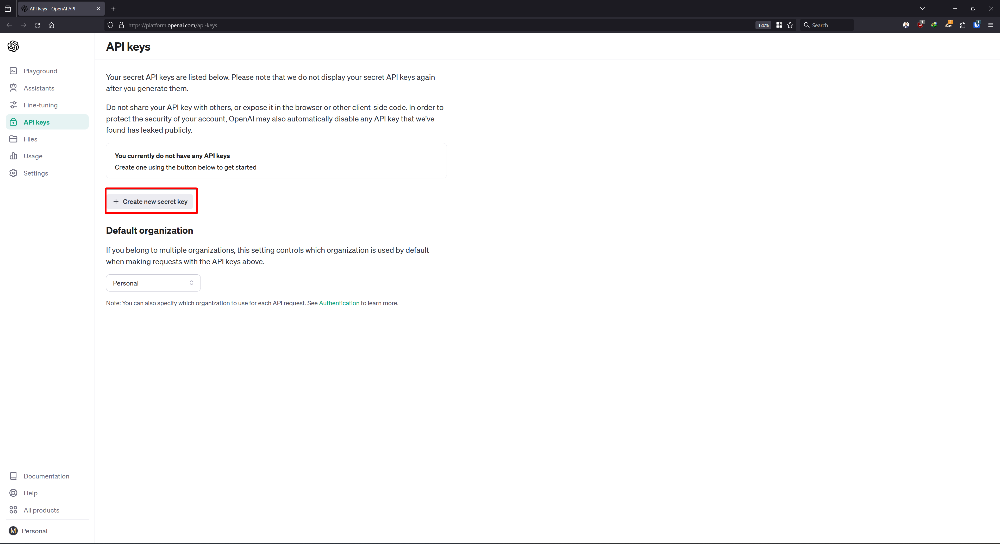

# Spring AI with OpenAI Models

Dive straight into using Spring AI with Open AI models via the quick start project and explore the integration.

See [sb3-ai-sample](https://github.com/mtkhawaja/sb3-ai-sample) for a sample project based on this post.

## Pre-requisites

- [spring-boot cli](https://github.com/spring-projects/spring-cli/releases)
- [Java 17](https://adoptium.net/temurin/releases/?package=jdk&version=17)

### OpenAI API Key

- Create an [OpenAI Account](https://chat.openai.com/auth/login) if you don't already have one.
- Navigate to the [API Keys](https://platform.openai.com/api-keys) page and create a new API key.



- Save this key for later as it'll be used to set the `SPRING_AI_OPENAI_API_KEY` environment variable later.

**Note**: You will be eligible for some [free credits](https://help.openai.com/en/articles/4936830-what-happens-after-i-use-my-free-tokens-or-the-3-months-is-up-in-the-free-trial) (**$5**) if you created a new account.
However, those credits are only valid for 3 months. Consequently, You'll need to purchase some credits if you want to use the API for longer.
Review the [Pricing - OpenAI](https://openai.com/pricing) and [Rate Limits - OpenAI](https://platform.openai.com/docs/guides/rate-limits/usage-tiers) for more information.

## Initialize a new Spring AI project

Use the [spring-boot cli](https://github.com/spring-projects/spring-cli/releases) to create a new spring-ai project:

```bash
#!/usr/bin/env bash

spring boot new ai \
  --name . \
  --group-id "com.muneebkhawaja.ai" \
  --artifact-id "sample" \
  --version "0.0.1-SNAPSHOT"

```

Alternatively, if using PowerShell:

```pwsh
#!/usr/bin/env pwsh

spring.exe boot new ai `
  --name . `
  --group-id "com.muneebkhawaja.ai" `
  --artifact-id "sample" `
  --version "0.0.1-SNAPSHOT"
```

**Note**: Update the `--name <name-of-project>` option if you want to create a new directory for the project.

Your project should have the following structure:

```text
├── .gitignore
├── README.md
├── mvnw
├── mvnw.cmd
├── pom.xml
└── src
    └── main
        └── java
            └── com
                └── muneebkhawaja
                    └── ai
                        └── sample
                            ├── Application.java
                            └── simple
                                ├── Completion.java
                                └── SimpleAiController.java
```

### Updating Dependencies

At the time of writing, the following dependency is added to the `pom.xml` file when creating the project via the spring cli i.e.

````xml

<dependency>
    <groupId>org.springframework.experimental.ai</groupId>
    <artifactId>spring-ai-openai-spring-boot-starter</artifactId>
    <version>0.2.0-SNAPSHOT</version>
</dependency>
````

According to the [spring-ai project README.md on GitHub](https://github.com/spring-projects/spring-ai), the project's group ids are transitioning from `org.springframework.experimental.ai` to `org.springframework.ai`.
As such, review the [Spring AI Documentation](https://docs.spring.io/spring-ai/reference/getting-started.html) for the latest version and update the `spring-ai-openai-spring-boot-starter` dependency in the pom.xml accordingly i.e.

```xml

<dependency>
    <groupId>org.springframework.ai</groupId>
    <artifactId>spring-ai-openai-spring-boot-starter</artifactId>
    <version>0.8.0-SNAPSHOT</version>
</dependency>
```

## Running the application

```shell

```bash   
#!/usr/bin/env bash
export SPRING_AI_OPENAI_API_KEY=<INSERT KEY HERE>
./mvnw spring-boot:run 
```

Alternatively, if using PowerShell:

```pwsh
#!/usr/bin/env pwsh

set-content env:SPRING_AI_OPENAI_API_KEY "<INSERT KEY HERE>"
.\mvnw.cmd  spring-boot:run 
```

The application should be accessible at [http://localhost:8080](http://localhost:8080)

### Trying out endpoints

The quick start project comes with some default endpoints that you can try out i.e.

```shell
#!/usr/bin/env bash

curl --get --data-urlencode 'message=Tell me a joke about a cow.' http://localhost:8080/ai/simple
```

Alternatively, if using PowerShell:

```pwsh
#!/usr/bin/env pwsh

Invoke-WebRequest -Method Get -Uri http://localhost:8080/ai/simple -Body @{ message = "Tell me a joke about a cow." }
```

A sample response is given below:

```text
Why did the cow go to space?

Because it wanted to see the mooooon!
```

## Notes about Model Usage

The default implementation of [AiClient](https://github.com/spring-projects/spring-ai/blob/main/spring-ai-core/src/main/java/org/springframework/ai/client/AiClient.java)
in `spring-ai-openai-spring-boot-starter` i.e. [OpenAiClient](https://github.com/spring-projects/spring-ai/blob/main/spring-ai-openai/src/main/java/org/springframework/ai/openai/client/OpenAiClient.java )
uses the `gpt-3.5-turbo` model.

## References

- Pricing - OpenAI, [openai.com/pricing](https://openai.com/pricing)
- Rate Limits - OpenAI API, [platform.openai.com/docs/guides/rate-limits/usage-tiers](https://platform.openai.com/docs/guides/rate-limits/usage-tiers)
- Spring AI Reference, [docs.spring.io/spring-ai/reference](https://docs.spring.io/spring-ai/reference/)
- Spring-CLI, [github.com/spring-projects/spring-cli/releases](https://github.com/spring-projects/spring-cli/releases)
- Spring-Projects/Spring-AI: An Application Framework for AI Engineering, [github.com/spring-projects/spring-ai](https://github.com/spring-projects/spring-ai)
- Temurin JDK-17 Releases, [adoptium.net/temurin/releases/?package=jdk&amp;version=17](https://adoptium.net/temurin/releases/?package=jdk&version=17)
- "What happens after I use my free tokens or the 3 months is up in the free trial", OpenAI
  Help, [help.openai.com/en/articles/4936830-what-happens-after-i-use-my-free-tokens-or-the-3-months-is-up-in-the-free-trial](https://help.openai.com/en/articles/4936830-what-happens-after-i-use-my-free-tokens-or-the-3-months-is-up-in-the-free-trial)
